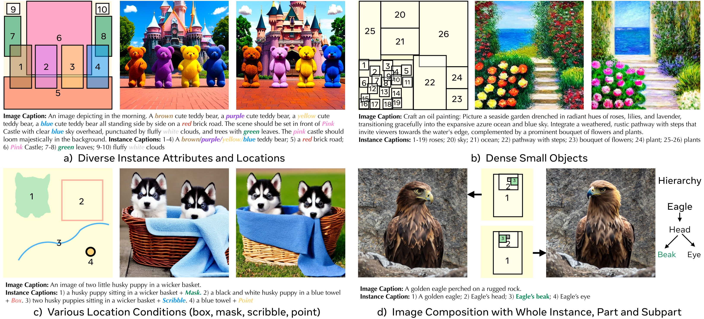
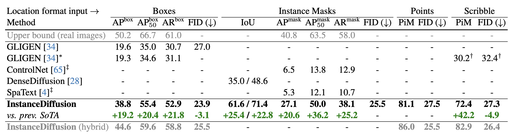
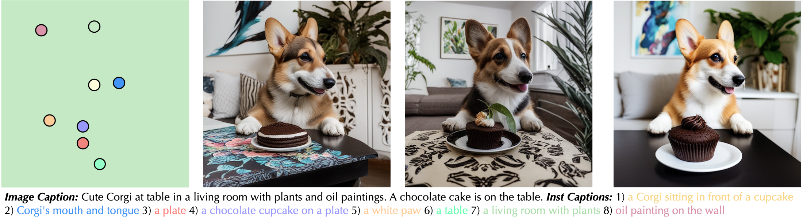

# InstanceDiffusion: Instance-level Control for Image Generation

We introduce **InstanceDiffusion** that adds precise instance-level control to text-to-image diffusion models. InstanceDiffusion supports free-form language conditions per instance and allows flexible ways to specify instance locations such as simple **single points**, **scribbles**, **bounding boxes** or intricate **instance segmentation masks**, and combinations thereof. 
Compared to the previous SOTA, InstanceDiffusion achieves **2.0 times** higher AP50 for box inputs and **1.7 times** higher IoU for mask inputs.

<p align="center">  </p>

> [**InstanceDiffusion: Instance-level Control for Image Generation**](http://people.eecs.berkeley.edu/~xdwang/projects/InstDiff/)            
> [Xudong Wang](https://people.eecs.berkeley.edu/~xdwang/), [Trevor Darrell](https://people.eecs.berkeley.edu/~trevor/), [Saketh Rambhatla](https://rssaketh.github.io/), 
[Rohit Girdhar](https://rohitgirdhar.github.io/), [Ishan Misra](https://imisra.github.io/)     
> GenAI, Meta; BAIR, UC Berkeley            
> Preprint             

[[`project page`](http://people.eecs.berkeley.edu/~xdwang/projects/InstDiff/)] [[`arxiv`](https://arxiv.org/abs/2402.03290)] [[`PDF`](https://arxiv.org/pdf/2402.03290.pdf)] [[`bibtex`](#citation)]             


## Disclaimer
This repository represents a re-implementation of InstanceDiffusion conducted by the first author during his time at UC Berkeley. Minor performance discrepancies may exist (differences of ~1% in AP) compared to the results reported in the original paper. The goal of this repository is to replicate the original paper's findings and insights, primarily for academic and research purposes.


## Updates
* 02/25/2024 - InstanceDiffusion is ported into [ComfyUI](#third-party-implementations). Check out some cool [video demos](#third-party-implementations)! (thanks to Tucker Darby) 
* 02/21/2024 - Support flash attention, memory usage can be reduced by more than half.
* 02/19/2024 - Add PiM evaluation for scribble-/point-based image generation
* 02/10/2024 - Add model evaluation on attribute binding
* 02/09/2024 - Add model evaluation using the MSCOCO dataset
* 02/05/2024 - Initial commit. Stay tuned


## Installation
### Requirements
- Linux or macOS with Python ≥ 3.8
- PyTorch ≥ 2.0 and [torchvision](https://github.com/pytorch/vision/) that matches the PyTorch installation.
  Install them together at [pytorch.org](https://pytorch.org) to make sure of this. 
- OpenCV ≥ 4.6 is needed by demo and visualization.

### Conda environment setup
```bash
conda create --name instdiff python=3.8 -y
conda activate instdiff

pip install -r requirements.txt
```


## Training Data Generation
See [Preparing Datasets for InstanceDiffusion](dataset-generation/README.md).


## Method Overview
<p align="center">
  
</p>

<p align="center">
  
</p>

InstanceDiffusion enhances text-to-image models by providing additional instance-level control. In additon to a global text prompt, InstanceDiffusion allows for paired instance-level prompts and their locations (e.g. points, boxes, scribbles or instance masks) to be specified when generating images. 
We add our proposed learnable UniFusion blocks to handle the additional per-instance conditioning. UniFusion fuses the instance conditioning with the backbone and modulate its features to enable instance conditioned image generation. Additionally, we propose ScaleU blocks that improve the UNet’s ability to respect instance-conditioning by rescaling the skip-connection and backbone feature maps produced in the UNet. At inference, we propose Multi-instance Sampler which reduces information leakage across multiple instances.

Please check our [paper](https://arxiv.org/abs/2402.03290) and [project page](http://people.eecs.berkeley.edu/~xdwang/projects/InstDiff/) for more details.


## InstanceDiffusion Inference Demons
If you want to run InstanceDiffusion demos locally, we provide `inference.py`. Please download the pretrained InstanceDiffusion from [Hugging Face](https://huggingface.co/xudongw/InstanceDiffusion/tree/main) or [Google Drive](https://drive.google.com/drive/folders/1Jm3bsBmq5sHBnaN5DemRUqNR0d4cVzqG?usp=sharing) and [SD1.5](https://huggingface.co/runwayml/stable-diffusion-v1-5/resolve/main/v1-5-pruned-emaonly.ckpt), place them under `pretrained` folder and then run it with:
```
python inference.py \
  --num_images 8 \
  --output OUTPUT/ \
  --input_json demos/demo_cat_dog_robin.json \
  --ckpt pretrained/instancediffusion_sd15.pth \
  --test_config configs/test_box.yaml \
  --guidance_scale 5 \
  --alpha 0.8 \
  --seed 0 \
  --mis 0.36 \
  --cascade_strength 0.3 \
```
The JSON file `input_json` specifies text prompts and location conditions for generating images, with several demo JSON files available under the `demos` directory. 
The `num_images` parameter indicates how many images to generate. 
The `mis` setting adjusts the proportion of timesteps utilizing multi-instance sampler, recommended to be below 0.4. A higher `mis` value can decrease information leakage between instances and improve image quality, but may also slow the generation process.
Adjusting `alpha` modifies the fraction of timesteps using instance-level conditions, where a higher `alpha` ensures better adherence to location conditions at the potential cost of image quality, there is a trade-off.
The SDXL refiner is activated if the `cascade_strength` is larger than 0. Note: The SDXL-Refiner was NOT employed for quantitative evaluations in the paper, but we recently found that it can improve the image generation quality.

Our implementation supports Flash/Math/MemEfficient attention, utilizing PyTorch's `torch.backends.cuda.sdp_kernel`. To disable it, simply set `efficient_attention: False` in the configuration `.yaml` file.

The bounding box should follow the format [xmin, ymin, width, height]. The mask is expected in RLE (Run-Length Encoding) format. Scribbles should be specified as [[x1, y1],..., [x20, y20]] and can have duplicated points, and a point is denoted by [x, y].


### Let's Get Everybody Turning Heads!
InstanceDiffusion supports image compositions with granularity spanning from entire instances to parts and subparts. The positioning of parts/subparts can implicitly alter the overall pose of the object.

https://github.com/frank-xwang/InstanceDiffusion/assets/58996472/1c4205a5-c3c4-4605-9fbd-c7023d4a4768

```
python inference.py \
  --num_images 8 \
  --output OUTPUT/ \
  --input_json demos/eagle_left.json \
  --ckpt pretrained/instancediffusion_sd15.pth \
  --test_config configs/test_box.yaml \
  --guidance_scale 5 \
  --alpha 0.8 \
  --seed 0 \
  --mis 0.2 \
  --cascade_strength 0.3 \
```


### Image Generation Using Single Points
InstanceDiffusion supports generating images using points (with one point each instance) and corresponding instance captions.
<p align="center">
  
</p>

```
python inference.py \
  --num_images 8 \
  --output OUTPUT/ \
  --input_json demos/demo_corgi_kitchen.json \
  --ckpt pretrained/instancediffusion_sd15.pth \
  --test_config configs/test_point.yaml \
  --guidance_scale 5 \
  --alpha 0.8 \
  --seed 0 \
  --mis 0.2 \
  --cascade_strength 0.3 \
```


### Iterative Image Generation
https://github.com/frank-xwang/InstanceDiffusion/assets/58996472/b161455a-6b21-4607-a59d-3a6dd19edab1

InstanceDiffusion can also support iterative image generation, with minimal changes to pre-generated instances and the overall scene. Using the identical initial noise and image caption, InstanceDiffusion can selectively introduce new instances, substitute one instance for another, reposition an instance, or adjust the size of an instance via modifying the bounding boxes. 

```
python inference.py \
  --num_images 8 \
  --output OUTPUT/ \
  --input_json demos/demo_iterative_r1.json \
  --ckpt pretrained/instancediffusion_sd15.pth \
  --test_config configs/test_box.yaml \
  --guidance_scale 5 \
  --alpha 0.8 \
  --seed 0 \
  --mis 0.2 \
  --cascade_strength 0.3 \
```

`--input_json` can be set to `demo_iterative_r{k+1}.json` for generating images in subsequent rounds.


## Model Quantitative Evaluation on MSCOCO
### Location Conditions (point, scribble, box and instance mask)
Download the [MSCOCO 2017 datasets](https://cocodataset.org/#download) and store them in the `datasets` folder, ensuring the data is organized as follows:
```
coco/
  annotations/
    instances_val2017.json
  images/
    val2017/
      000000000139.jpg
      000000000285.jpg
      ...
```

Please download the customized [instances_val2017.json](https://drive.google.com/file/d/1sYpb7jRZJyBJYPFHyjxosIDaiQhkrEhU/view?usp=drive_link), which resizes all images to 512x512 and adjusts the corresponding masks/boxes accordingly. Once you have organized the data, proceed with executing the following commands:

```
CUDA_VISIBLE_DEVICES=0 python eval_local.py \
    --job_index 0 \
    --num_jobs 1 \
    --use_captions \
    --save_dir "eval-cocoval17" \
    --ckpt_path pretrained/instancediffusion_sd15.pth \
    --test_config configs/test_mask.yaml \
    --test_dataset cocoval17 \
    --mis 0.36 \
    --alpha 1.0

pip install ultralytics
mv datasets/coco/images/val2017 datasets/coco/images/val2017-official
ln -s generation_samples/eval-cocoval17 datasets/coco/images/val2017
yolo val segment model=yolov8m-seg.pt data=coco.yaml device=0
```
We divide all samples evenly across `--num_jobs` splits, with each job (GPU) responsible for generating a portion of the validation dataset. The `--job_index` parameter specifies the job index for each individual job.


### Attribute Binding
```
test_attribute="colors" # colors, textures
CUDA_VISIBLE_DEVICES=0 python eval_local.py \
    --job_index 0 \
    --num_jobs 1 \
    --use_captions \
    --save_dir "eval-cocoval17-colors" \
    --ckpt_path pretrained/instancediffusion_sd15.pth \
    --test_config configs/test_mask.yaml \
    --test_dataset cocoval17 \
    --mis 0.36 \
    --alpha 1.0
    --add_random_${test_attribute}

# Eval instance-level CLIP score and attribute binding performance
python eval/eval_attribute_binding.py --folder eval-cocoval17-colors --test_random_colors
```
To assess InstanceDiffusion's performance in texture attribute binding, set `test_attribute` to `textures` and replace `--test_random_colors` with `--test_random_textures`.

### PiM Evaluation for Scribble-/Point-based Image Generation
```
python eval_local.py \
    --job_index 0 \
    --num_jobs 1 \
    --use_captions \
    --save_dir "eval-cocoval17-point" \
    --ckpt_path pretrained/instancediffusion_sd15.pth \
    --test_config configs/test_point.yaml \
    --test_dataset cocoval17 \
    --mis 0.36 \
    --alpha 1.0

pip install ultralytics
mv datasets/coco/images/val2017 datasets/coco/images/val2017-official
ln -s generation_samples/eval-cocoval17-point datasets/coco/images/val2017
yolo val segment model=yolov8m-seg.pt data=coco.yaml device=0

# Please indicate the file path for predictions.json generated in the previous step
python eval/eval_pim.py --pred_json /path/to/predictions.json

```
To evaluate PiM for scribble-based image generation, change `--test_config` to `configs/test_scribble.yaml` when executing `python eval_local.py`. Additionally, include `--test_scribble` when running `python eval/eval_pim.py`.
We divide all samples evenly across `--num_jobs` splits, with each job (GPU) responsible for generating a portion of the validation dataset. The `--job_index` parameter specifies the job index for each individual job.


## InstanceDiffusion Model Training 
To train InstanceDiffusion with submitit, start by setting up the conda environment according to the instructions in [INSTALL](##Installation). Then, prepare the training data by following the guidelines at [this link](dataset-generation/README.md). Next, download [SD1.5](https://huggingface.co/runwayml/stable-diffusion-v1-5/resolve/main/v1-5-pruned-emaonly.ckpt) to the `pretrained` folder. Finally, run the commands below:
```
run_name="instancediffusion"
python run_with_submitit.py \
    --workers 8 \
    --ngpus 8 \
    --nodes 8 \
    --batch_size 8 \
    --base_learning_rate 0.00005 \
    --timeout 20000 \
    --warmup_steps 5000 \
    --partition learn \
    --name=${run_name} \
    --wandb_name ${run_name} \
    --yaml_file="configs/train_sd15.yaml" \
    --official_ckpt_name='pretrained/v1-5-pruned-emaonly.ckpt' \
    --train_file="train.txt" \
    --random_blip 0.5 \
    --count_dup true \
    --add_inst_cap_2_global false \
    --enable_ema true \
    --re_init_opt true \
```
For more options, see `python run_with_submitit.py -h`.

## Third-party Implementations
[ComfyUI-InstanceDiffusion](https://github.com/logtd/ComfyUI-InstanceDiffusion): Tucker Darby helps to port InstanceDiffusion into ComfyUI. Followings are a few videos demos created by Tucker (videos are made with a ComfyUI workflow that uses AnimateDiff with AnimateLCM as the method of consistency):

Demo1             |  Demo2
-------------------------|-------------------------
  |  


## License and Acknowledgment
The majority of InstanceDiffusion is licensed under the [Apache License](LICENSE), however portions of the project are available under separate license terms: CLIP, BLIP, Stable Diffusion and GLIGEN are licensed under their own licenses; If you later add other third party code, please keep this license info updated, and please let us know if that component is licensed under something other than Apache, CC-BY-NC, MIT, or CC0.


## Ethical Considerations
InstanceDiffusion's wide range of image generation capabilities may introduce similar challenges to many other text-to-image generation methods. 


## How to get support from us?
If you have any general questions, feel free to email us at [XuDong Wang](mailto:xdwang@eecs.berkeley.edu). If you have code or implementation-related questions, please feel free to send emails to us or open an issue in this codebase (We recommend that you open an issue in this codebase, because your questions may help others). 


## Citation
If you find our work inspiring or use our codebase in your research, please consider giving a star ⭐ and a citation.

```
@misc{wang2024instancediffusion,
      title={InstanceDiffusion: Instance-level Control for Image Generation}, 
      author={Xudong Wang and Trevor Darrell and Sai Saketh Rambhatla and Rohit Girdhar and Ishan Misra},
      year={2024},
      eprint={2402.03290},
      archivePrefix={arXiv},
      primaryClass={cs.CV}
}
```
